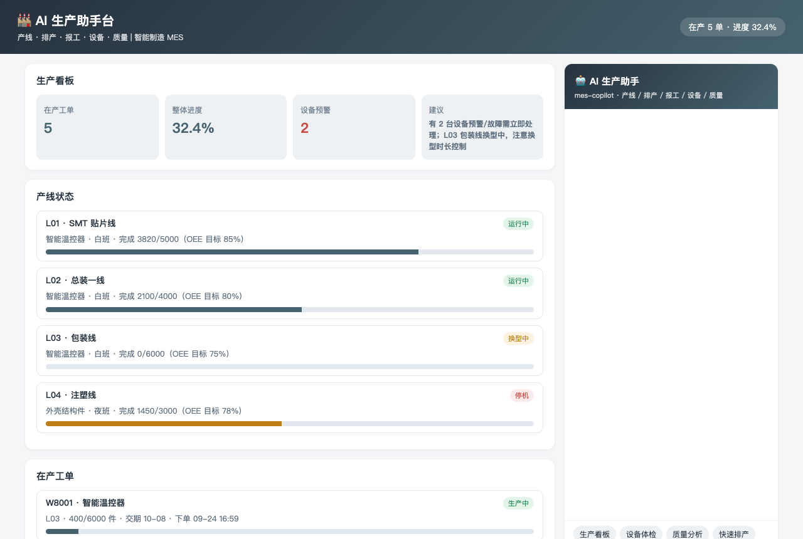
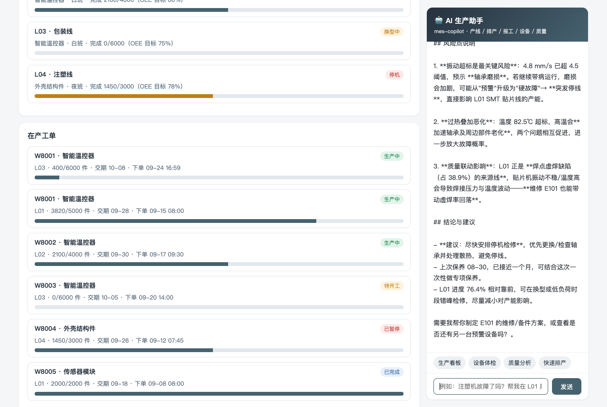
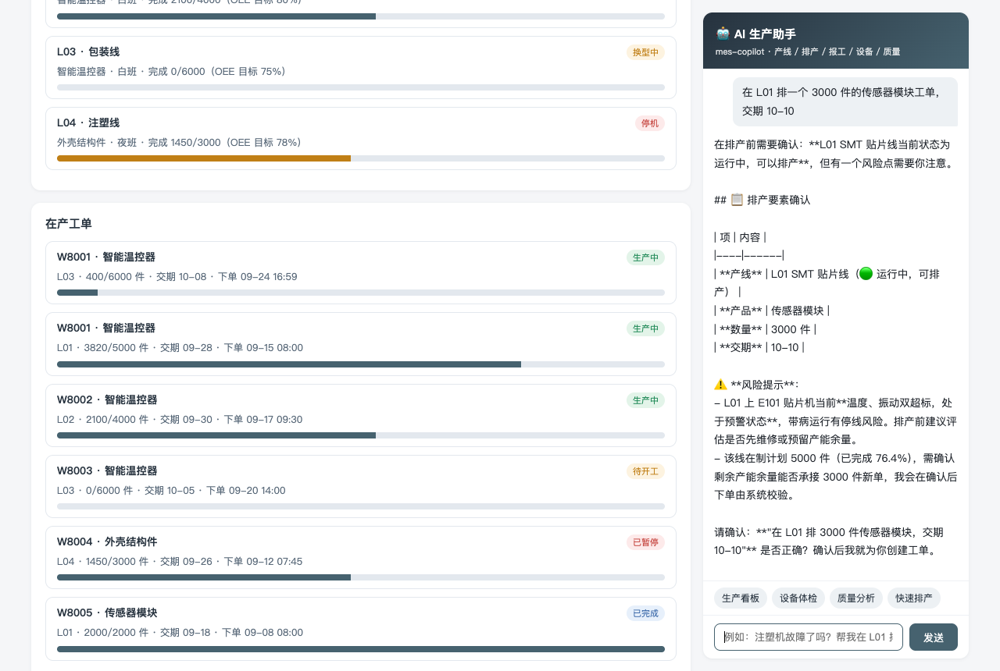
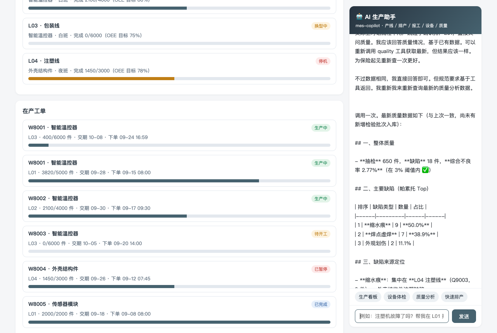

# AI 生产助手台 · 使用说明

> 面向车间主任/计划员/设备员的操作手册。左侧是生产看板、产线状态与在产工单，右侧 AI 助手用自然语言看产线、排产、报工、查设备、析质量。

## 一、页面导览

打开 `http://127.0.0.1:18098/`：

1. **顶部横幅**：在产工单数与整体进度一眼看清。
2. **生产看板**：在产工单 / 整体进度 / 设备预警数 / 处置建议。
3. **产线状态**：4 条产线的产品、班次、完成进度条（<50% 黄色预警）、OEE 目标。
4. **在产工单**：工单号/产品/状态标签/产线/完成数/交期/进度条。
5. **AI 生产助手**（右侧面板）：快捷提问（生产看板/设备体检/质量分析/快速排产）+ 输入框，SSE 流式回答。

## 二、AI 能干什么（对应 6 个工具）

| 你说的话 | AI 做的事 | 背后工具 |
|----------|-----------|----------|
| "各产线什么状态" | 列产线状态、进度与 OEE 目标 | `line_list` |
| "整体进度/今天看板" | 在产单数/进度/设备预警/处置建议 | `stats` |
| "排一个新单" | 校验产能与产线状态，二次确认后生成工单号 | `schedule` |
| "报工 400 件" | 累计完成数并自动流转状态 | `report` |
| "贴片机要修吗" | 温度/振动/时长三阈值体检 + 维保建议 | `equipment` |
| "质量怎么样" | 不良率 + 帕累托 top 缺陷 + 改善建议 | `quality` |

## 三、典型对话示例

**例 1 · 设备体检**

> 你：E101 贴片机需要维修吗？
> AI：⚠️ 建议尽快停机检修。**振动 4.8mm/s 超 4.5 阈值，轴承可能磨损**；温度 82.5℃ 超 80℃ 阈值。上次保养 08-30，建议专项保养+更换轴承。

**例 2 · 排产二次确认**

> 你：在 L01 排一个 3000 件的传感器模块工单，交期 10-10
> AI：请确认：L01 SMT 贴片线（运行中，可排产）· 传感器模块 · **3000 件** · 交期 10-10。⚠️ L01 上 E101 有预警，排产前建议评估维修。
> 你：确认
> AI：✅ 已排产，**工单号 W8006**，排队在在产余量之后。

**例 3 · 质量帕累托**

> 你：最近质量怎么样？
> AI：综合不良率 2.77%（阈值内）。Top 缺陷：**缩水痕 50%**（集中在 L04 注塑线）→ 焊点虚焊 38.9%（与 E101 贴片机温度/振动超标相关）。建议先修 E101，借 L04 停机窗口做模具保养。

## 四、回答规则（系统提示词已内置）

1. 排产前必须**复述产线/产品/数量/交期并获确认**；排产与报工结果必报工单号。
2. 停机/保养中产线**明确告知不可排产**并给替代方案。
3. 设备异常必须给出**具体阈值对比**（当前值 vs 阈值）与维保建议。
4. 质量分析必须点出 **top 缺陷类型与占比**，>3% 给改善建议。
5. 数据全部来自工具返回，禁止编造产线与工单数据。

## 五、常见问题

**Q：什么样的产线不能排产？**
停机、保养中两种状态直接拦截。运行中/换型中可排产，但换型中会提示注意换型时长。

**Q：排产被拦说超产能怎么办？**
在产余量+新单超过两倍日产能时会拦截。可以：拆成多张工单分批、延后交期、或换到有余量的产线。

**Q：设备什么情况算异常？**
三阈值任一超限：温度≥80℃（过热）、振动≥4.5mm/s（轴承磨损）、累计运行≥8000h（大修周期）。6000-8000h 会提示接近大修。

**Q：AI 没反应？**
确认 DSH 服务（127.0.0.1:8090）在运行、`mes-copilot` 插件处于 ACTIVE 状态，见 README「快速开始」。
